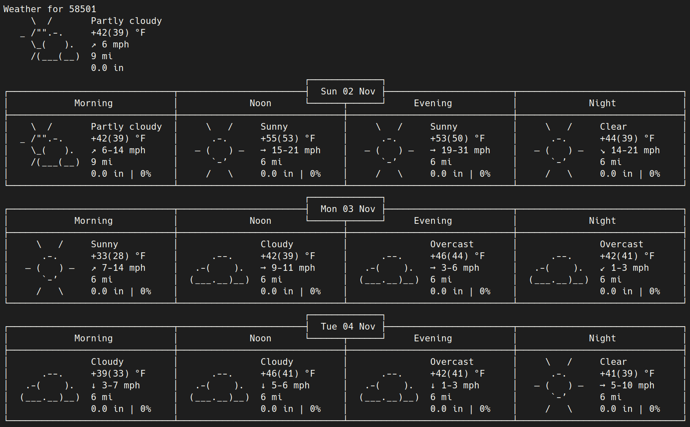

# i3blocks-weather

Weather display script for [i3blocks] status bar. Fetches weather information from [wttr.in] and displays it in your status bar with an interactive popup for detailed forecasts.

[![License: GPL v2][license-badge]][license]

## Installation

1. Clone this repository:
```bash
git clone https://github.com/hastinbe/i3blocks-weather.git
cd i3blocks-weather
```

2. Make the script executable:
```bash
chmod +x weather
```

3. Configure your `i3blocks` config file (typically `~/.config/i3blocks/config`):

   Add the weather block configuration to your i3blocks config. See `i3blocks.conf` for a complete example. The basic configuration:

```ini
[weather]
full_text=☂ฺ ☀ฺ Weather ☂ฺ ☀ฺ
command=~/i3blocks-weather/weather
interval=1800
color=#8ec07c
#separator=true
separator_block_width=20
```

Replace `~/i3blocks-weather/weather` with the actual path to the `weather` script.

### Dependencies

The script requires the following dependencies:
- `curl` - For fetching weather data from wttr.in
- `rofi` - For displaying the interactive weather popup
- `jq` - For parsing JSON configuration from i3wm

Install dependencies on:
- **Debian/Ubuntu**: `sudo apt install curl rofi jq`
- **Arch Linux**: `sudo pacman -S curl rofi jq`
- **Fedora**: `sudo dnf install curl rofi jq`

## Usage

### i3blocks Integration

Add the weather block to your i3blocks configuration as shown in the installation section. The script will:
- Display weather information (temperature, wind, condition icon, humidity) in your status bar
- Update automatically every 30 minutes (1800 seconds) as specified by `interval`
- Show a detailed ASCII weather report when you click on the block (left-click)

#### Display Format

The script displays weather information in the following format:
- **Full line**: `ICON TEMPERATURE WIND 💧HUMIDITY`
- **Short line**: `TEMPERATURE`
- **Color**: Dynamically set based on weather conditions (sunny, cloudy, rainy, snowy, foggy)


### Interactive Popup

Click on the weather block in your status bar (left-click) to open an interactive rofi popup showing:
- Full ASCII weather report from wttr.in
- Detailed forecast information
- Current conditions and extended forecast

The popup automatically matches your i3bar colors and font settings.



## Comparison with rofi-wttr

This script was designed as an enhanced alternative to [rofi-wttr] from i3blocks-contrib. Below is a feature comparison:

| Feature | i3blocks-weather | [rofi-wttr] |
|---------|-----------------|-------------|
| **Caching** | ✅ Yes (15 min default, configurable) | ❌ No |
| **Lock file** | ✅ Yes (prevents concurrent runs) | ❌ No |
| **Color coding** | ✅ Yes (automatic based on conditions) | ❌ No |
| **Config file** | ✅ Yes (`~/.config/i3blocks-weather/config`) | ❌ No |
| **Error handling** | ✅ Yes (fallback to cache, dependency checks) | ❌ No |
| **Auto-detect i3 colors** | ✅ Yes (matches bar colors/font) | ❌ No |
| **Customizable format** | ✅ Yes (via `FORMAT` variable) | ⚠️ Limited |
| **Units selection** | ✅ Yes (US/metric via `UNITS`) | ⚠️ Hardcoded |
| **Debug mode** | ✅ Yes | ❌ No |
| **Structured output** | ✅ Yes (full/short/color lines) | ⚠️ Single line |
| **Complexity** | Higher (~335 lines) | Lower (~70 lines) |
| **Dependencies** | curl, rofi, jq | curl, rofi |
| **Offline support** | ✅ Yes (uses cache) | ❌ No |
| **Cache control** | ✅ Yes (configurable duration, set to 0 to disable) | ❌ No |

### Key Advantages

**i3blocks-weather** provides a more robust solution with:
- **Performance**: Caching reduces API calls and provides instant responses
- **Reliability**: Lock files prevent race conditions; error handling with fallbacks
- **User Experience**: Automatic color coding, color/font matching with i3bar
- **Flexibility**: Extensive configuration options via config file or environment variables
- **Offline capability**: Works with cached data when network is unavailable

**rofi-wttr** is better for:
- **Simplicity**: Easier to understand and modify (~70 lines)
- **Minimal dependencies**: Doesn't require `jq`

## Configuration

`i3blocks-weather` looks for a configuration file located at either `~/.config/i3blocks-weather/config`, or `$XDG_CONFIG_HOME/i3blocks-weather/config`. You can use this file to set any variables that are not set in the command line or environment.

Create the configuration directory and file:
```bash
mkdir -p ~/.config/i3blocks-weather
```

Then edit `~/.config/i3blocks-weather/config` with your settings. By default, the script will auto-detect your location based on your IP address. For example, if you want to always use metric units:

```bash
UNITS="m"
CACHE_DURATION=1800
```

Or if you want to set a specific location:

```bash
LOCATION="Bismarck,ND"
UNITS="m"
CACHE_DURATION=1800
```

Or if you want to customize the popup appearance and use a custom location:

```bash
LOCATION="Paris,France"
UNITS="m"
ROFI_WIDTH="70%"
ROFI_CONFIG_FILE="$HOME/.config/rofi/config.rasi"
DEBUG=0
```

Now every invocation of the script will use these settings, unless overridden by environment variables or command line options.

### Configuration Variables

| Variable | Description | Default |
|----------|-------------|---------|
| `LOCATION` | Weather location (city name, postal code, or coordinates). Leave empty to auto-detect based on IP | `""` (auto-detect) |
| `FORMAT` | wttr.in format string for weather data | `%t+%w+%c+%h` |
| `UNITS` | Temperature units: `u` (US), `m` (metric), `M` (metric with wind in m/s) | `u` |
| `CACHE_DURATION` | Cache duration in seconds | `900` (15 minutes) |
| `CACHE_FILE` | Path to cache file | `/tmp/weather-wttr-cache.txt` |
| `POPUP_CACHE_FILE` | Path to popup cache file | `/tmp/weather-wttr-popup-cache.txt` |
| `BAR_ID` | i3bar identifier (auto-detected if not set) | Auto-detected |
| `ROFI_CONFIG_FILE` | Path to rofi config file | `/dev/null` |
| `ROFI_WIDTH` | Width of rofi popup window | `65%` |
| `ROFI_LOCATION` | Location of rofi popup window | `northwest` |
| `FONT` | Font for rofi popup (auto-detected from i3bar if not set) | Auto-detected |
| `WEATHER_BG` | Background color for rofi popup (auto-detected from i3bar) | Auto-detected |
| `WEATHER_FG` | Foreground color for rofi popup (auto-detected from i3bar) | Auto-detected |
| `DEBUG` | Enable debug output (set to `1` to enable) | `0` |
| `LABEL` | Optional label prefix for the weather display | Empty |

### Location Configuration

By default, the script will auto-detect your location based on your IP address. You can set a specific location in several ways:

1. **Using a configuration file** (recommended):
```bash
# ~/.config/i3blocks-weather/config
# Leave LOCATION unset or empty to auto-detect, or set a specific location:
LOCATION="Bismarck,ND"
# or
LOCATION="58501"  # Postal code
# or
LOCATION="48.8566,2.3522"  # Coordinates
```

2. **Using environment variables**:
```bash
export LOCATION="Bismarck,ND"
```

3. **In your i3blocks config**:
```ini
[weather]
full_text=☂ฺ ☀ฺ Weather ☂ฺ ☀ฺ
command=env LOCATION="Bismarck,ND" /path/to/this/repo/weather
interval=1800
```

### Units Configuration

- `u` - US units (Fahrenheit, mph)
- `m` - Metric units (Celsius, km/h)
- `M` - Metric units with wind in m/s

Set in your config file:
```bash
# ~/.config/i3blocks-weather/config
UNITS="m"
```

Or using environment variables:
```bash
export UNITS="m"  # Use metric units
```

### Custom Format

The `FORMAT` variable controls which weather data is fetched. Default format `%t+%w+%c+%h` includes:
- `%t` - Temperature
- `%w` - Wind
- `%c` - Condition emoji
- `%h` - Humidity

See [wttr.in format documentation](https://github.com/chubin/wttr.in#one-line-output) for all available format options.

## Weather Icons and Colors

The script automatically assigns colors based on weather conditions:

| Condition | Icon | Color |
|-----------|------|-------|
| Sunny | ☀️ | `#FFCC66` |
| Partly Cloudy | 🌤️ ⛅ 🌥️ | `#ADD8E6` |
| Rainy | 🌦️ 🌧️ ⛈️ | `#4169E1` |
| Snowy | ❄️ 🌨️ | `#E0FFFF` |
| Foggy | 🌫️ | `#D3D3D3` |
| Unknown | (none) | `#ffffff` |

## Troubleshooting

### Script not displaying weather

1. Check that all dependencies are installed:
```bash
which curl rofi jq
```

2. Test the script manually:
```bash
DEBUG=1 /path/to/weather
```

3. Verify your location is valid by testing with curl:
```bash
curl "https://wttr.in/YourLocation?format=%t+%w+%c+%h"
```

### Popup not showing

1. Ensure rofi is installed and working:
```bash
rofi -version
```

2. Check that i3wm is running (required for bar config detection):
```bash
i3-msg -t get_version
```

3. Enable debug mode to see what's happening:
```bash
DEBUG=1 /path/to/weather
```

### Cache issues

If you're seeing stale weather data, you can:
1. Manually delete the cache files:
```bash
rm /tmp/weather-wttr-cache.txt /tmp/weather-wttr-popup-cache.txt
```

2. Reduce the `CACHE_DURATION` in the script (line 24)

## License

`i3blocks-weather` is released under [GNU General Public License v2][license]

Copyright (C) 2024 Beau Hastings

[i3blocks]: https://github.com/vivien/i3blocks
[rofi-wttr]: https://github.com/vivien/i3blocks-contrib/blob/master/rofi-wttr/rofi-wttr
[wttr.in]: https://wttr.in
[license]: https://www.gnu.org/licenses/gpl-2.0.en.html
[license-badge]: https://img.shields.io/badge/License-GPL%20v2-blue.svg

